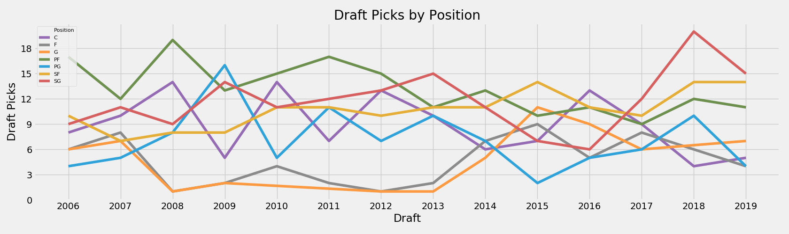
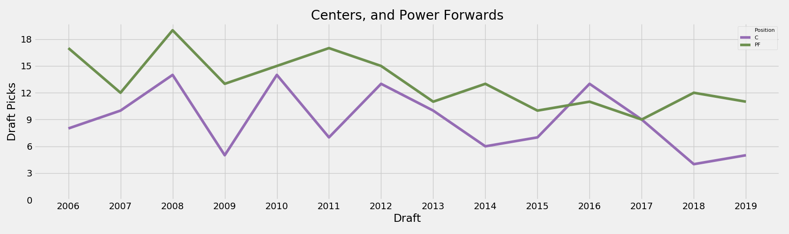
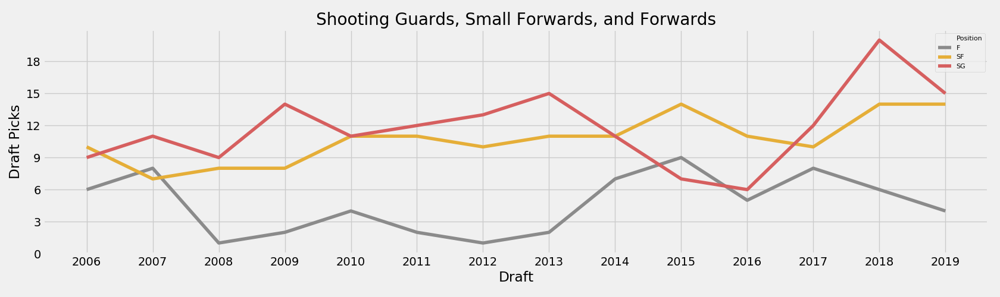
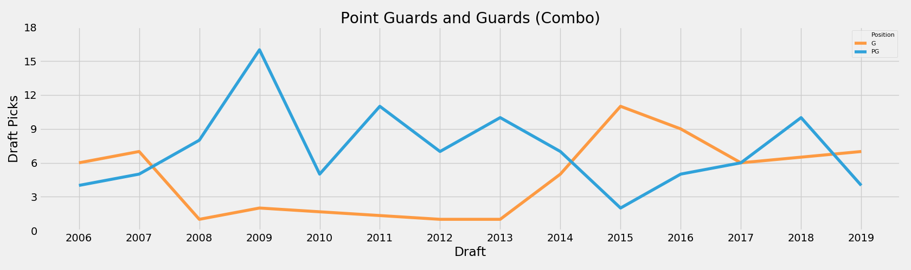
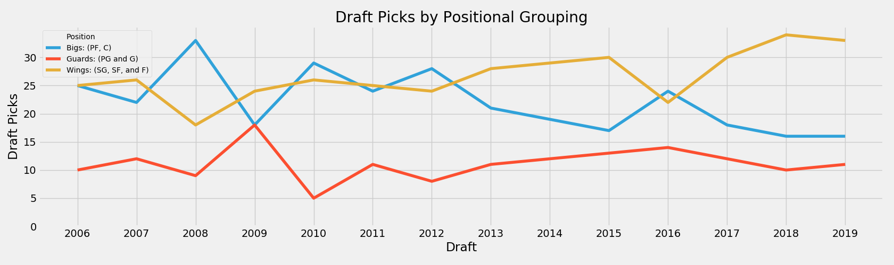
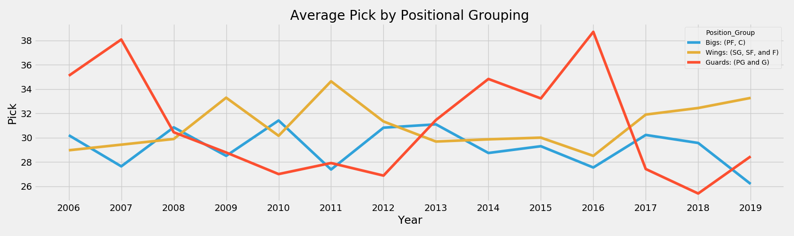
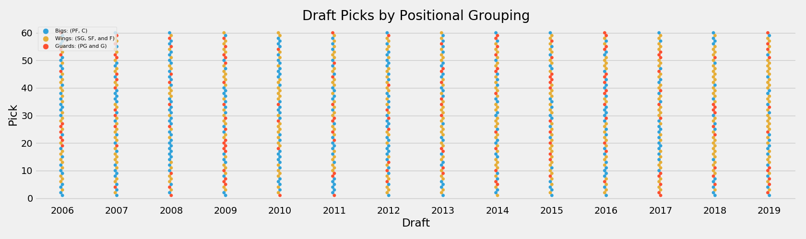
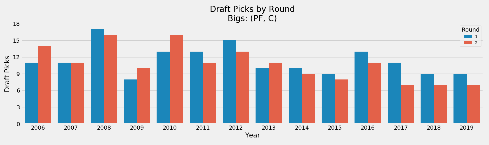
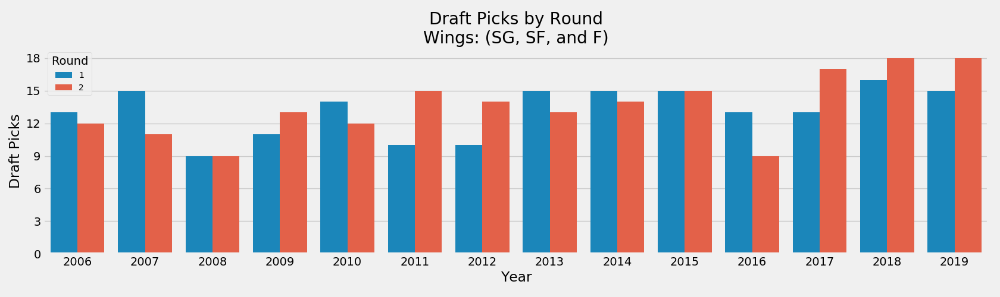
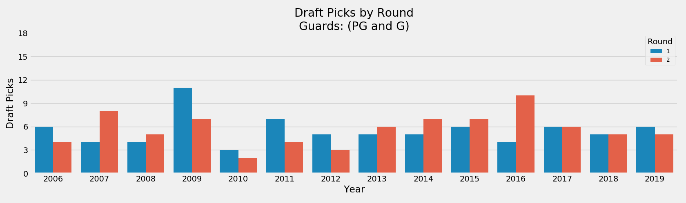

# Draft Positions
---
#### Intro
Quick thread following up to the trend @DraftExpress alluded to this week in regards to the diminishing market for big men in the draft.

#### Plots

Looking at pick totals by position (as definied by @RealGM) since one-and-done era began (2006-2019).

A steady decrease in the number of 'bigs' (PF and C) selected since 2008, primarily Centers since 2016.

Conversely, a rise in 'wings' (SG, SF, and F), primarily Shooting Guards since 2016.

Number of 'Guards' (PG and G) selected has stayed somewhat steady over time.

Note the rise in 'G' and 'F' classification in the last two plots. Assuming this is somewhat structural since players are being defined more broadly in the 'position-less age' (Ex: G = Point Guard or Combo Guard).

Grouping the previous granular positions into 'Positional Groupings' (Guards, Wings, and Bigs), we observe the same trends with a divergence in the number of bigs and wings being selected.

It appears the increase in wings is being skewed towards later in the draft. The few centers being drafted are being taken early.

What will the lack of top-guard prospects between 2013-2016 mean for the near-future of the free agent guard market?

A more granular view illustrating the second-round trend of taking wings over bigs and the dearth of top-tier guards taken between 2013-2016. Very few guards taken between picks 10-30 recently.

While there is a diminishing market for bigs in the draft, the loss of demand hasn't been equal across rounds. There is still demand for the high-end (first round) big.

Again, teams are placing lots of bets on wings late in the draft to make up for current positional scarcity.

While there has never been a large volume of 'guards' taken in the first round (outside of 2009), I'm curious if we will see a future trend of positional scarcity in top-tier lead guards in the same way we see a lack of top wing talent now.

#### Data and Definitions
Dataset: [RealGM Draft Data](https://basketball.realgm.com/nba/draft/search?showPicks=&year_2019=&year_2018=&year_2017=&year_2016=&year_2015=&year_2014=&year_2013=&year_2012=&year_2011=&year_2010=&year_2009=&year_2008=&year_2007=&year_2006=&pick_range_min=1&pick_range_max=230&age_range_min=17&age_range_max=27&height_range_min=69&height_range_max=91&weight_range_min=150&weight_range_max=375&yos_range_min=0&yos_range_max=21&all_star_range_min=0&all_star_range_max=15&all_nba_range_min=0&all_nba_range_max=15&all_defense_range_min=0&all_defense_range_max=14)

#### Position Definitions
| RealGM  | Position  | Positional Grouping  |
|---|---|---|
| PF  | PF  | Big  |
| SG  | SG  | Wing  |
| SF  | SF  | Wing  |
| C  | C  | Big  |
| PG  | PG  | Guard  |
| G  | G  | Guard  |
| F  | F  | Wing  |
| PF/C  | PF  | Big  |
| FC  | PF  | Big  |
| C/PF  | C  | Big  |
| SG/SF  | SG  | Wing  |
| GF  | SF  | Wing  |
| SF/SG  | SF  | Wing  |
| SF/PF  | SF  | Wing  |
| PG/SG  | PG  | Guard  |
| PF/SF  | PF  | Big  |
| SG/PG  | SG  | Wing  |
| SG/PF  | SG  | Wing  |
| F-G  | F  | Wing  |
