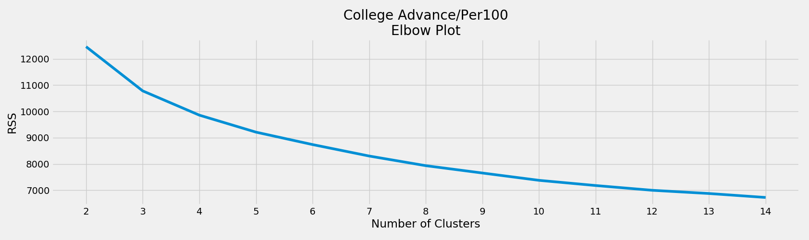
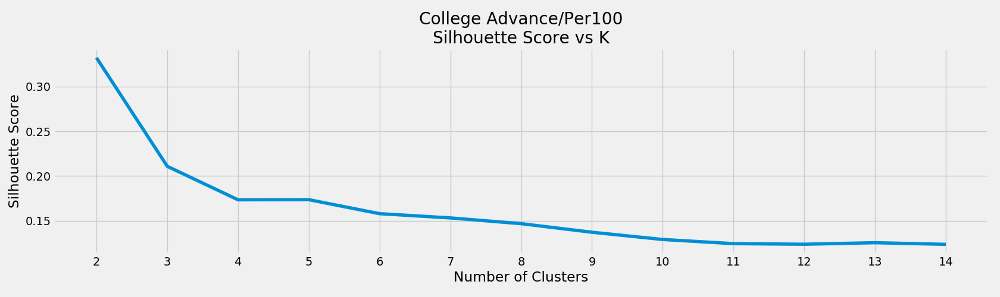
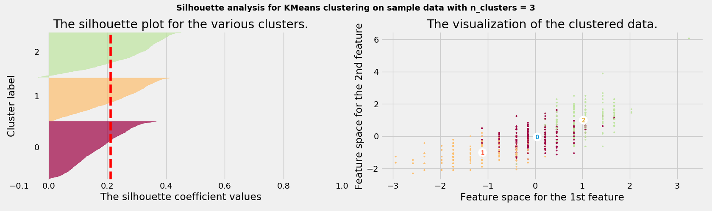
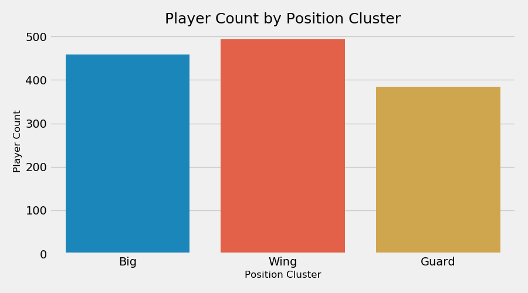
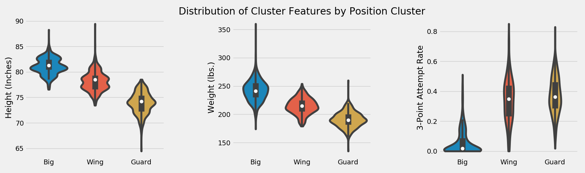
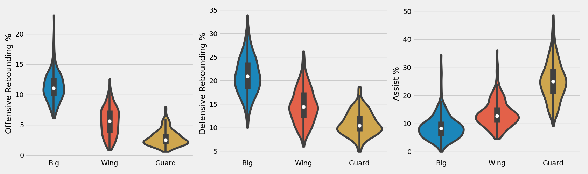
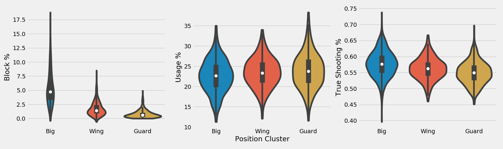

College Position Clustering
---
#### Motivation
To track positional scarcity trends over time and to create relative benchmark groups within which to compare player performance we clustered NBA players based on their college statistics. This will give us a sense of what positional designation (guard, wing, big) a player was in each of their respective college seasons and track positional movement throughout their entire career arc.

Future work will look to expand this approach using college play-type data to create more granular positions in which to classify players (i.e, 'play-making wing', '3-D wing', etc.)

---
#### Methodology
We utilized a K-Means algorithm to cluster all NBA players between 2004-2019 based on their college box-score statistics scraped from Sports-Reference.com. Aligning with our NBA positional clusterig the model inputs were:

    1. Height (inches)
    2. Weight (pounds)
    3. 3-Point Attempt Rate
    4. Offensive Rebound Percentage
    5. Defensive Rebound Percentage
    6. Assist Percentage
    7. Block Percentage
    8. Usage Percentage
    9. True Shooting Percentage

We used two approaches to determine the 'optimal' number of clusters the first being a traditional elbow method. While not pronounced, the largest elbow appears at a cluster value of 3, which also lines up with our NBA positional clustering. Similarly, there are no cluster values greater than three that have a higher silhouette score, although 5 could be a viable option. Examining the silhouette analysis, we see that the three clusters are well-balanced and all above the average silhouette coefficient value.
Cluster number 2 appears to be the only cluster with a few potentially mis-classified records.

For players without any available advanced stats used in the above clustering step (mostly players from before 2010), we used a nearest-neighbor algorithm to classify which cluster each player belonged based on their Per-40 Minute data.  

---
#### Findings
The three clusters selected align into 'Guard', 'Wing', and 'Big' designations. There appears to be slightly more wings in total and fewer guards but overall the distribution is relatively uniform.

Looking at the distribution of the clustering features we see distinct differentiation across the positional cluster types, although less so for USG% and TS%.

---
#### Future Work
We will look to expand this approach using play-type data to create more granular-level positional distinctions.

---
#### Data
All data scraped from Sports-Reference.
