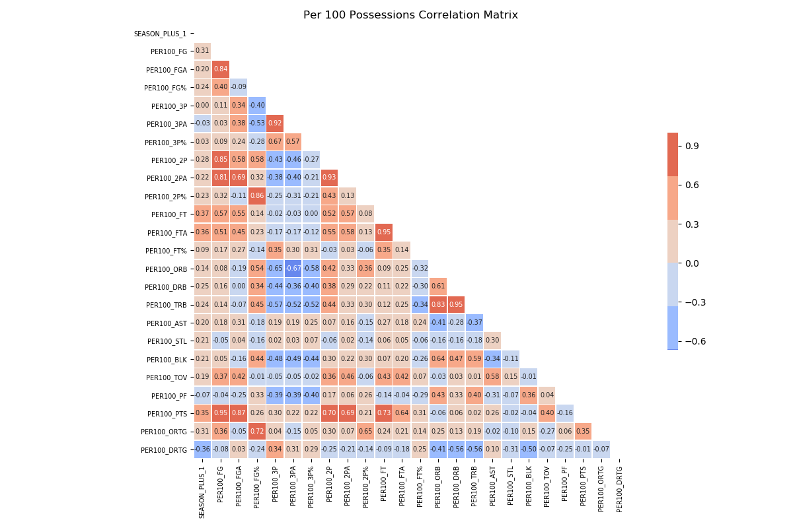
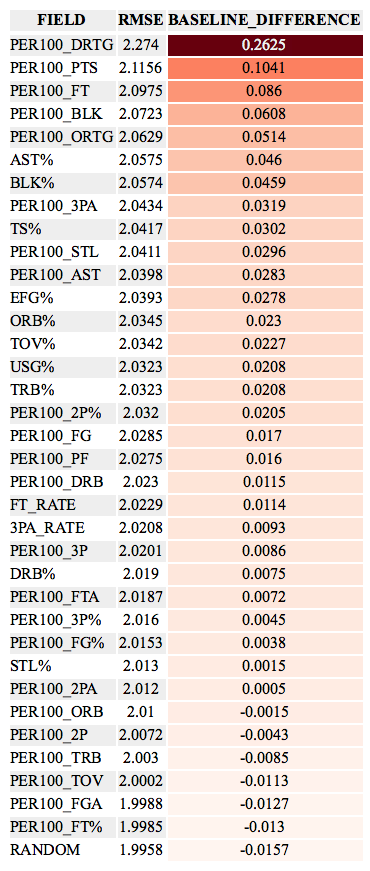
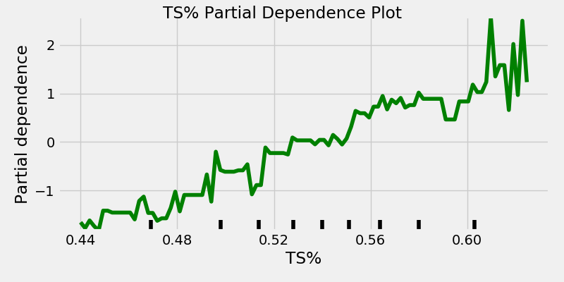

Feature Selection/EDA
---
#### Motivation
To better understand the relationship between individual features and the target variable (+1 Season RPM/BPM Blend), we utilized three main techniques. First, to determine the strength of the relationship between each feature and the target we examined the correlation between the two. We also looked at the full correlation matrix to uncover potential collinearity. Second, we used permutation importance to gain a better understanding of how important a feature was in predicting the target variable. Lastly, we looked at partial dependence plots to uncover the form and direction of the relationship. The following provides a brief overview  of the work.

#### Correlation Table
The following table contains the rank order of features based on the strength of their relationship with the target variable as represented by both the pearson and spearman correlation. Unsurprisingly, BPM, and VORP which is a function of BPM, has the strongest relationship with the +1 BPM/RPM blend.  Other advanced metrics that aim to represent many of the box score statistics in one metric are also at the top of the list exemplifying their utility.

Free throws (`PER100_FT` and `Per100_FTA`) appear near the top of the list as do various shooting metrics (`TS%` and `PER100_FG%`). Surprisingly, three-point shooting metrics fall near the bottom of the list (`3PA_RATE`, `PER100_3PA`, `PER100_3P%`, and `PER100_3P`).

#### Correlation Matrix
Keeping in mind that many of the box-score statistics listed above are highly correlated we looked at the correlation matrix of both per 100 possession features and advanced features. A few worthy notes:

* `PER` an all-encompassing statistic that is often sited publicly but lost favor in basketball analytics community over the years shows one of it's major deficiencies in not being related to defensive production as illustrated by its limit correlation with `DBPM` and `DWS`.
* Relatedly, defensive metrics based on box-score data remain limited at best. DBPM and DWS are only slightly correlated.
* `PER100_ORB` and `PER100_3PA` has the strongest negative relationship, which makes intuitive sense, but as the game changes with more players possessing the physical characteristics to rebound at a high-level and the skill to shoot threes efficiently it will be interesting to see if this changes.

#### Permutation Importance
[Permutation Importance](https://explained.ai/rf-importance/)  
The first attempt includes all advanced metrics, which overwhelm most of the traditional box-score statistics as they're highly correlated. We see that BPM and VORP ...

#### Partial Dependence Plots

