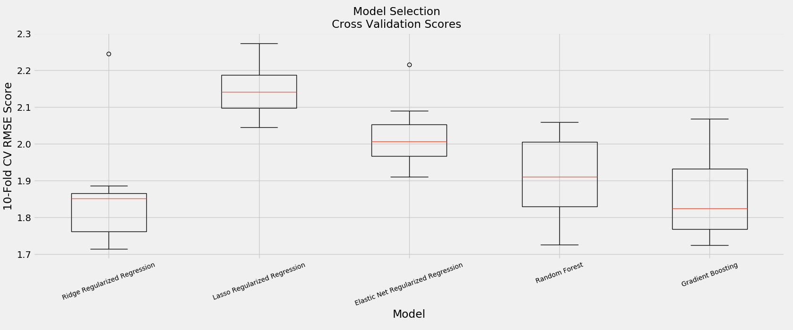
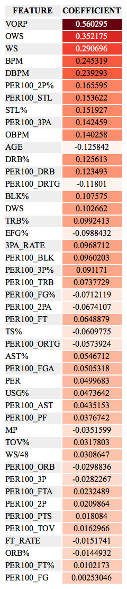
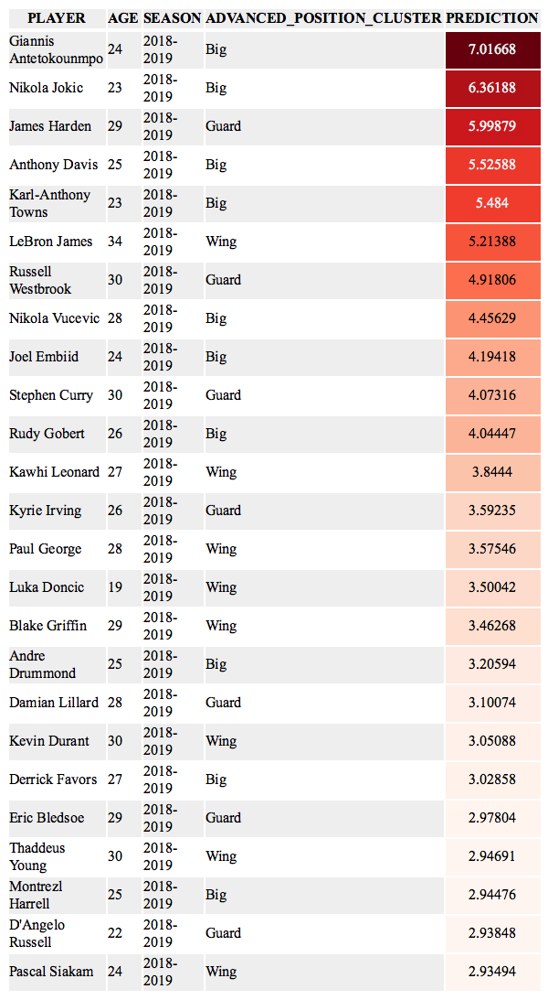
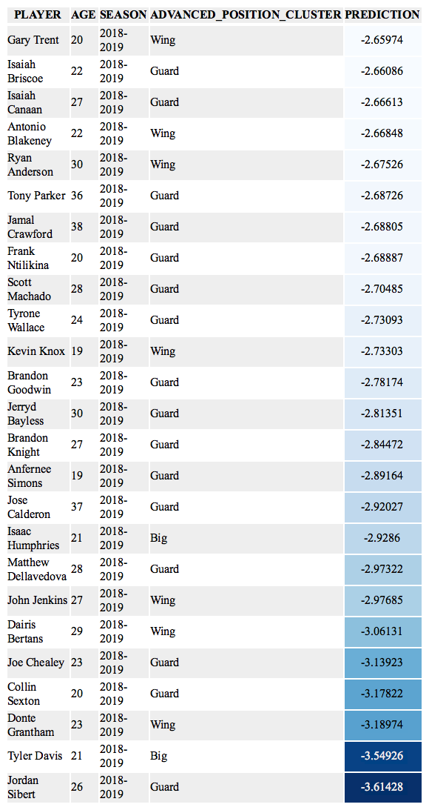

Model Selection
---
#### Motivation
Having engineered an input dataset containing per-100 possession and advanced box-score data we now evaluate potential algorithms to use as our final model.

#### Cross Validation
After performing a 75/25 train/test split and scaling each subset of data, we performed a 10-fold cross validation on five model types to gain a general understanding of what model best fits out data. Using default parameters for sklean's implementation of Ridge, Lasso, Elastic Net, Random Forest, and Gradient Boosting algorithms, we observed the following RMSE scores. Of the regularized regression model types Ridge far outperforms Lasso and Elastic Net. Gradient Boosting performs best overall but only slightly better than the Ridge model.



#### GridSearch
With the Ridge and Gradient Boosting algorithms performing best in our 'naive' cross validation approach we then performed a gridsearch on each to optimize parameters, which are listed below.

**Ridge Regression Gridsearched Parameters:**
```
Best Params: {'alpha': 4.1, 'solver': 'sag', 'tol': 0.07901}
```
**Gradient Boosting Gridsearched Parameters:**
```
Best Params: {'learning_rate': 0.1, 'loss': 'huber', 'max_depth': 2, 'n_estimators': 110, 'warm_start': True}
```

#### Test Set Performance
With our optimized parameters, we scored the test set for both potential models above. The Ridge Regression recorded a RMSE of 1.95 while the Gradient Boosting model recorded a 1.89. The BPM/RPM blend we used as our target variable ranged from -9.87 to 9.84 in our training set. With an optimal test score, we'll use the Gradient Boosting model to make our final predictions. However, as a thought exercise we can examine the coefficients from the final Ridge model to get a sense of feature importance.

As we found in the feature selection phase of the project, many of the 'all-encompassing' box-score metrics, VORP and BPM in particular are most predictive. Steal metrics (`PER100_STL` and `STL%`) show up higher in importance in the final model while free throw metrics (`PER100_FT`, `PER100_FTA`, and `FT_RATE`) all appeared lower. `AGE` appeared slightly higher as did `PER100_3PA`. `USG%` and `MP` again were not as high as the casual observer might expect.



#### 2019-2020 Predictions
The final predictions for the 2019-2020 season can be found in `predictions/predictions.csv`. A quick look at the top and bottom-25 players in our predictions broadly align with general consensus. Reigning MVP, Giannis Antetokounmpo, appears first followed by 2018-2019 First-Team All-NBA members Nikola Jokic and James Harden. At the other end of the spectrum we see a few second-year players, Kevin Knox and Collin Sexton, that recorded historically poor performances in 2018-2019 who are again projected to struggle.




#### Next Steps
To improve upon the existing model we will replicate the above process using new inputs such as three-season weighted averages, league percentiles, positional percentiles, measurements, salary, and more advanced metrics. Having optimized this 'one-season' model we will then expand our predictions into future seasons.
